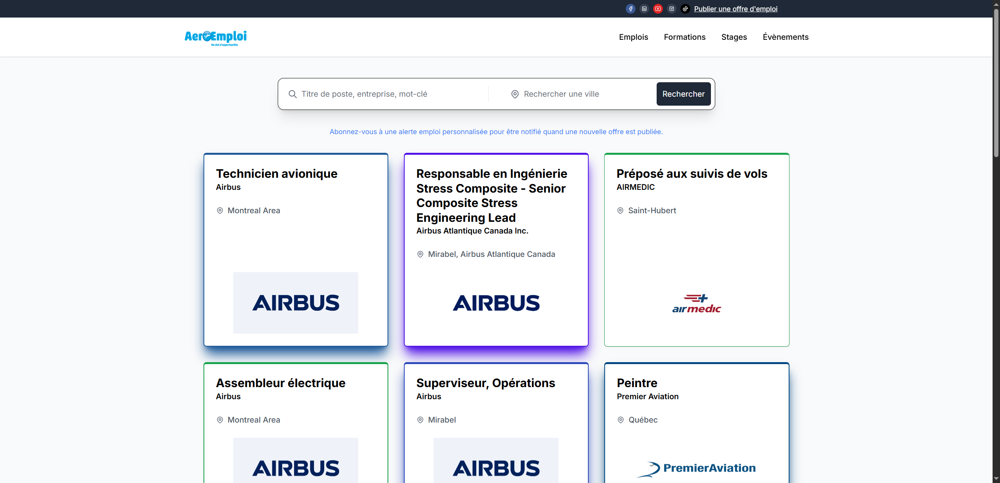
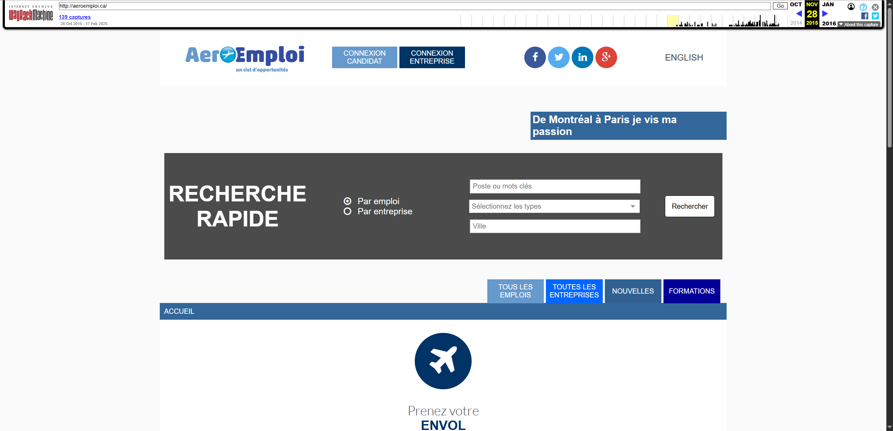
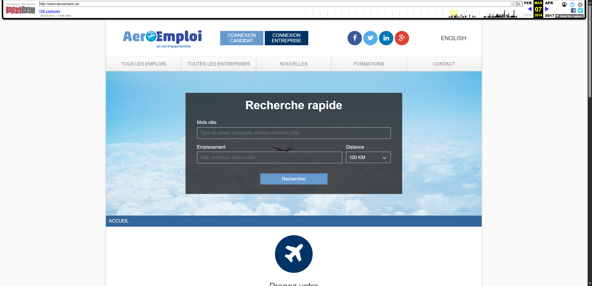
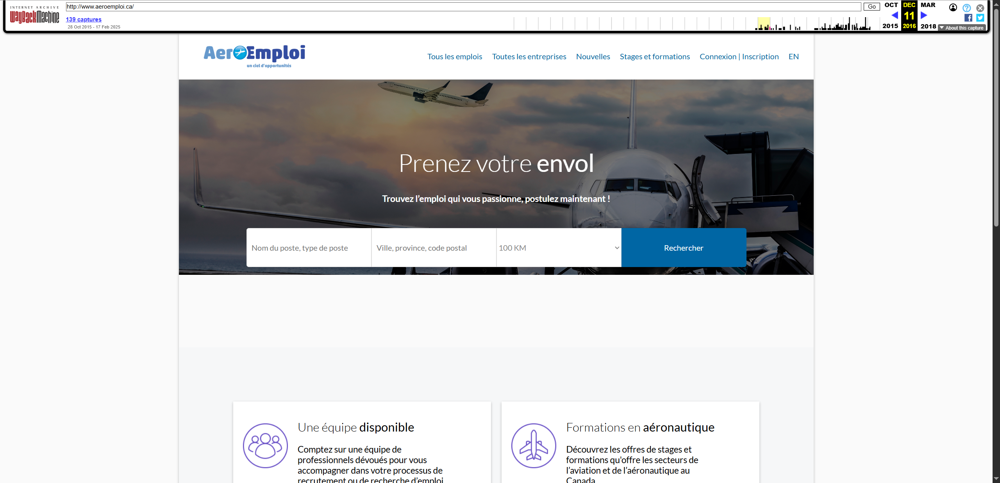
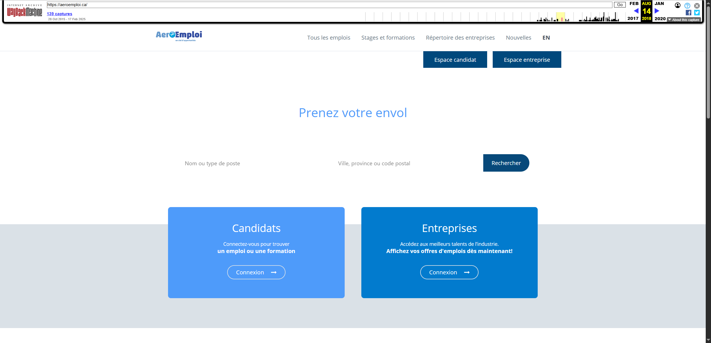
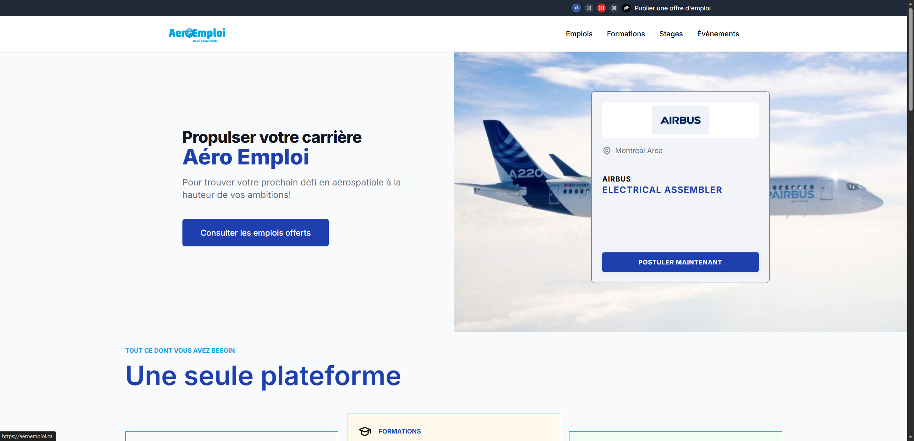

# Aeroemploi

[aeroemploi.ca](https://aeroemploi.ca) est une plateforme qui permet aux utilisateurs de :

-   Rechercher et consulter des offres d'emplois, formations, évènements
-   Postuler et s'inscrire sur ces items

Les affichages sont créés et gérés depuis Aeroweb. Les candidats ne doivent pas se créer de compte pour postuler, tout est public et gratuit.

## Histoire du site

Le site existe depuis plus d'une dizaine d'années. Depuis les toutes premières versions, le site a permis de rechercher et consulter des affichages de :

-   Offres d'emplois
-   Formations
-   Nouvelles

... dans l'industrie de l'aéronautique. Depuis quelques années on y retrouve également l'affichage d'évènements (réseautage, portes ouvertes, etc).

Le design a beaucoup évolué au fil des années :

Pour finalement arriver à la version actuelle :

Dans les récentes versions du site, on peut aussi consulter les stages qui sont issues du site https://placementspot.ca/.

Originalement, les utilisateurs pouvaient se connecter sur le site Aéroemploi directement :

-   Les administrateurs des entreprises se connectaient pour créer des affichages de postes, formations, gérer les applications et inscriptions

-   Les candidats devaient être connecté pour postuler et avaient un profil sur lequel ils pouvaient voir les offres sur lesquelles ils avaient postulé

Dans les dernières années, nous avons modifié le site pour utiliser un API pour aller chercher les offres (qui sont issues de la plateforme Aeroweb) et les candidats n'ont plus besoins de compte pour postuler.

Il n'est maintenant plus possilbe de se connecter du tout sur Aéroemploi, et le site n'utilise plus de base de données.
