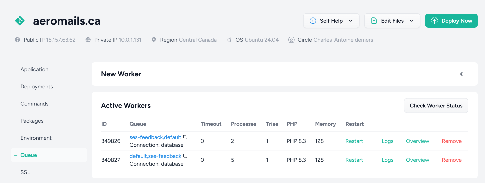

# Détails techniques

## Technologies utilisées

L'application Aeromails est développé avec les technologies suivantes : 

- Back-end Laravel (v.11)
- Front-end Vue 3 et TailwindCSS, avec [InertiaJS](https://www.inertiajs.com/)
- Base de données MySQL (v.8)
- Certains composents [ShadCN](https://www.shadcn-vue.com/)
- Amazon SES pour l'envoi des courriels
- Éditeur drag & drop [Unlayer](https://unlayer.com/)

## Architecture

Les principaux concepts sont : 

- Campagne `Campaign` (id, nom, statut)
- Liste d'envoi `SendingList` (id, nom)
- Abonné `SendingListSubscriber` (id, sending_list_id, email, status)
- Identité d'envoi `SendingIdentity` (id, nom, from_email, from_name, reply_to)

Pour l'envoi des courriels et le tracking des stats : 

- Envoi `Send` (id, campaign_id, sending_list_subscriber_id, status, sent_at, uuid)
- Ouverture `SendOpen` (id, send_id)
- Clic `SendClick` (id, send_id, url)

Pour envoyer une campagne, un utilisateur utilise l'interface pour la créer. Il doit spécifier un nom, une liste d'envoi, une identité à utiliser et utilise l'éditeur drag & drop pour créer le template. Une fois la campagne créé, elle peut être modifié et quand l'utilisateur est prêt, il clique sur le bouton Envoyer. On peut soit l'envoyer immédiatement ou céduler l'envoi pour plus tard - dans ce cas là, le `scheduler` de Laravel run à chaque minute et envoi les campagnes qui sont dûes pour être envoyées.

## Systèmes de queue et batching

Une fois l'envoi commencer, on dispatch une job qui : 

- Met à jour le statut de la campagne (prête à envoyer -> en cours d'envoi)
- Récupère les abonnés (`SendingListSubscriber`) à qui on doit envoyer le message. Si c'est un segment d'une campagne présente, on applique les filtres nécessaires
- On sépare les abonnés en batch (250, configurable) et pour chacun, on crée un Envoi (`Send`) dans la base de données. C'est ce modèle qu'on utilise pour faire le suivi par la suite, ie savoir si un courriel a été envoyé à un abonné en particulier, s'il s'est désabonné, s'il a cliqué sur un lien, etc.
- On groupe ces envois par batch (100, configurable) et pour chaque batch : on sauvegarde les envois (`Send`) dans la BD, et on dispatch une autre job pour faire l'envoi de la batch de courriels

Donc si on envoit une campagne à 100K abonnés, on va générer 1000 jobs dans la base de données, et chaque job va être responsable de l'envoi de 100 courriels.

Ensuite, chacune de ces jobs fait un loop des 100 courriels, et génère une job pour chaque envoi individuel. On va donc se retrouver avec 100K jobs dans la BD pour une campagne envoyée à 100K abonnés (en plus du 1000 initial). Ces jobs sont responsable de valider l'adresse courriel, de s'assurer qu'elle n'est pas dans la blacklist et ultimement d'envoyer le courriel à SES. C'est cette dernière job là aussi sur laquelle on applique le rate-limiting (14 envois/seconde max).

### Workers

Les workers sont configurés via Forge. Nous utilisons deux queues : `default` pour faire l'envoi des courriels, et `ses-feedback` pour lire le contenu de la queue Amazon SQS et insérer les statistiques dans notre base de données.

Les workers sont configurés comme suit : 

On utilise la connection `Database`, ça veut dire que les jobs sont sauvegardées dans la base de données, dans une table `jobs`. On pourrait aussi le modifier pour utiliser Redis, SQS ou d'autres options, mais le driver Database est généralement suffisant.

C'est important de mettre le `timeout=0` pour éviter que les jobs timeout après 60s. Certaines jobs peuvent prendre plusieurs minutes à compléter, notamment la job en charge de l'envoi de la campagne et la génération de toutes les autres jobs.

Nous avons 2 processus qui travaillent sur les queues `ses-feedback,default` et 5 processus qui travaillent sur les queues `default,ses-feedback`. La différence est que les processus (workers) vont d'abord vérifier s'il y a des jobs dans la première queue qui est spécifiée, et si celle-ci est vide alors ils vont considérer la deuxième option. Comme ça, dans le peak des envois on peut avoir les 7 workers au total pour faire l'envoi (s'il n'y a pas de stats) et dans le peak des stats, on peut avoir les 7 workers qui processent les stats (s'il n'y a pas d'envoi).

On peut augmenter le nombre de processus via Forge, mais avec 7 nous avons une bonne utilisation des ressources du serveur actuel.

## Stats

Pour le tracking des events "Open" et "Click", initialement nous avions configuré SES pour qu'ils fassent des requêtes HTTP POST à un endpoint sur Aeromails. Ça causait problème éventuellement quand nous avions un volume très élevé d'envoi, quand les stats commencaient à rentrer le serveur était surchargé.

Nous utilisons maintenant une queue sur AWS SQS pour stocker les messages (events), et c'est l'application Aeromails qui est en charge d'aller chercher les derniers messages périodiquement.

- Toutes les 10 secondes, on dispatch une job `ProcessSqsQueue`
- Cette job va chercher les 10 derniers messages dans la queue SQS
- Pour chaque message on dispatch une job `ProcessSqsMessage` qui trouve le Send correspondant via UUID et ajoute les stats dans notre base de données

::: info Note
Même si Laravel a un driver `SQS` d'inclut pour son système de queues/workers, nous ne pouvons pas lire les messages directement dans la queue SQS. Nous ne pouvons pas donc simplement créer des workers avec le driver `SQS` dans Forge, il faut utiliser l'approche manuelle avec le `ProcessSQSQueue` toutes les 10s.

La raison est que Laravel s'attend à une structure bien précise pour le contenu (payload) de la job, et que ce qui est envoyé dans SQS par SES est un format différent.

C'est probablement possible de retravailler cette approche - mais pour l'instant ça fonctionne.
:::