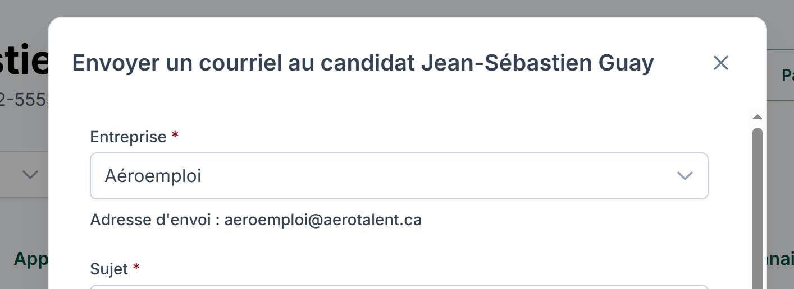
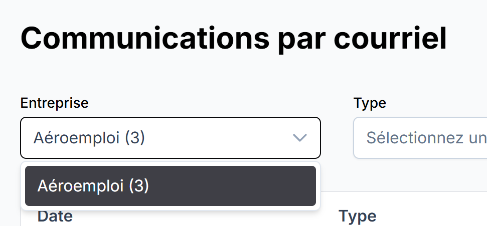
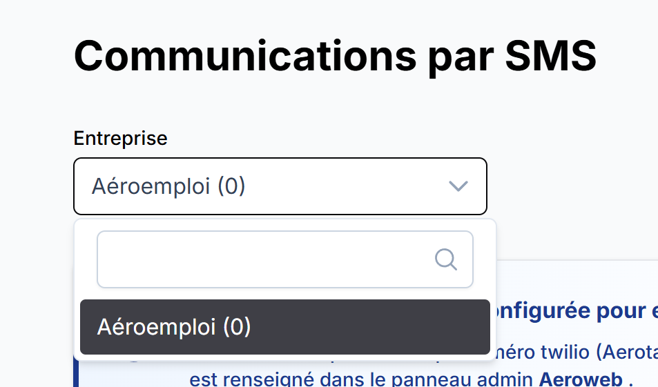
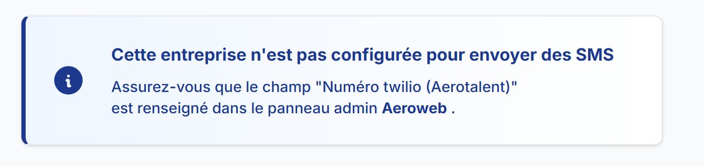
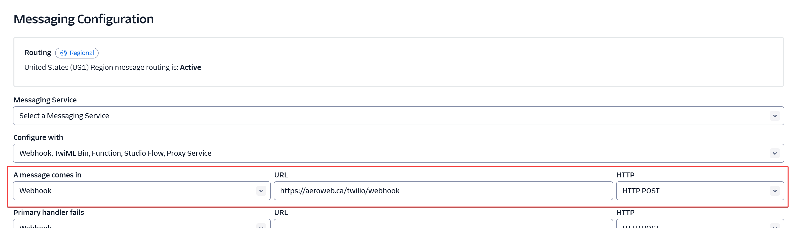
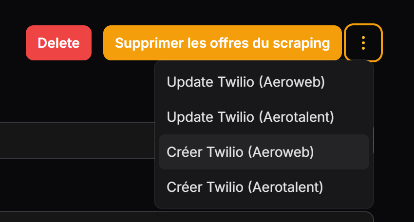

# Détails techniques

## Technologies utilisées

L'application Aeromails est développé avec les technologies suivantes :

-   Back-end Laravel (v.11)
-   Front-end Vue 3 et TailwindCSS, avec [InertiaJS](https://www.inertiajs.com/)
-   Base de données Postgres (v.16)
-   Moteur de recherche [Typesense](https://typesense.org/docs/28.0/api/) pour la recherche candidats

## Architecture

Les principaux concepts sont :

-   Candidats `Candidate` (id, name, email, phone_number)
-   Mandats `Mandate` (id, name, company_id)
-   Candidats mandatés `MandatedCandidate` (id, candidate_id, mandate_id, status)
-   Utilisateurs (recruteurs) `User` (id, name, email, password)

Toutes les données sont attachées à un candidat, et souvent un recruteur en particulier :

-   Commentaires `Comment` (id, candidate_id, user_id, comment, date)
-   Fichiers `File` (id, candidate_id, user_id, file_path)
-   Messages `SmsMessage` (id, candidate_id, from_number, to_number, message)

## Lien avec la base de données Aeroweb

Un détail important de la structure des données Aerotalent est que nous utilisons aussi les informations qui sont dans la base de données Aeroweb. C'est le cas pour :

-   Entreprises `AerowebCompany` (id, name)
-   Offres d'emplois `AerowebOffer` (id, company_id, title)
-   Formations `AerowebFormation` (id, company_id, title)
-   Évènements `AerowebEvent` (id, company_id, title)

La raison est qu'il y a plusieurs "concepts" sur Aerotalent qui sont attachés à des informations qui sont présentes sur Aeroweb seulement.

Par exemple, quand un candidat postule, c'est sur un poste Aeroweb. Nous ne voulons pas avoir à maintenir nos propres tables `offers`, `formations`, etc, et les garder en sync avec Aeroweb à chaque modification. Laravel supporte facilement de se connecter à plusieurs bases de données, alors c'est bien plus simple de se connecter à la BD Aeroweb en "read only" - aucune information n'est modifié sur Aerotalent pour ces tables, c'est vraiment juste pour lire les infos.

Si un entreprise se crée un compte sur Aeroweb, on veut que ses informations soient accessibles sur Aerotalent aussi. Nous pourrions mettre en place un système d'API avec webhooks ou autre pour garder les informations en sync, mais ça introduit de la complexité et pas de bénéfice.

## Nouvelles candidatures

Lorsqu'un candidat applique sur un poste affiché sur Aeroemploi, les informations sont envoyées à Aeroweb via un API et Aeroweb sauvegarde les informations dans sa base de données.

Puisque la structure des candidatures est très différente sur Aerotalent - c'est la principale raison pour laquelle on utilise une plateforme séparée - on ne veut pas se connecter directement à la table `candidates` de Aeroweb comme on fait pour aller chercher les offres ou entreprises.

Nous utilisons à la place un système de webhooks : quand une nouvelle candidate arrive sur Aeroweb, celui-ci fait un HTTP POST à une URL sur aerotalent.ca avec les informations sur la candidature :

-   Type d'application (offre d'emploi, formation, évènement)
-   ID du poste
-   Infos du candidat (nom, courriel, téléphone, CV, réponses aux formulaires customs)

C'est ensuite Aerotalent qui est responsable de :

1. Trouver un candidat existant dans la BD (on utilise l'adresse courriel comme identifiant unique), créer le candidat s'il n'existe pas déjà
2. Créer une entrée dans la table `applications` avec les informations reçues d'Aeroweb
3. Notifier les recruteurs si applicable

Puisque toutes les candidatures passent par Aeroweb, nous n'avons pas à modifié les autres sites. Dans le futur, nous aimerions aussi ajouter du support pour le site Placement SPOT.

## Communications - Courriels

Les recruteurs peuvent envoyer des courriels aux candidats directement via la plateforme. Quand les candidats répondent, les réponses sont enregistrées dans la BD et les infos affichées dans le dashboard.

Voici la structure de ce système :

-   Messages `EmailMessage` (id, candidate_id, aeroweb_company_id, user_id, message)
    -   Chaque message est associé à un candidat
    -   On associe aussi le message à une entreprise Aeroweb
    -   Si c'est un message sortant, on l'associe aussi au recruteur via `user_id`
-   Pièces-jointes `EmailMessageAttachment` (id, email_message_id, file_path)

### Adresse d'envoi

Si c'est le recruteur qui envoie le message, le champ `type` à une valeur de `OUTGOING` pour le message. On valide le contenu, et on envoie finalement le message (en utilisant Amazon SES) à l'adresse qui est au profil du candidat.

Les courriels sont envoyées en utilisant une adresse personnalisé `entreprise@aerotalent.ca`. Au moment d'envoyer le courriel, on sélectionne dans le dashboard Aerotalent l'entreprise qu'on veut utiliser :



Ça nous affiche le preview de l'adresse qui sera utilisée. Le préfix (la partie entreprise de entreprise@aerotalent.ca) qui est utilisé pour l'adresse est configuré dans la BD **Aeroweb**, c'est le champ `aerotalent_email_prefix` de la table `companies`. Ce préfix est défini pour toutes les entreprises et peut être modifié par un admin.

::: tip Pourquoi associer les courriels à une entreprise?
Même si les recruteurs sur Aerotalent peuvent voir tous les candidats peu importe de quelle entreprise ils proviennent, on veut quand même séparer les communications selon l'entreprise (avec le champ `aeroweb_company_id`). La raison est que nous utilisons des adresses et numéros différents. Dans le UI Aerotalent, on regroupe les communications par entreprise aussi :


:::

### Messages entrants (réponses des candidats)

Quand un candidat répond à un courriel envoyé par un recruteur via la plateforme Aerotalent, ça sera à une adresse `X@aerotalent.ca`. Nous avons configuré SES pour appeler un endpoint sur Aerotalent pour chaque message entrant à une de ces adresses.

Ensuite, la plateforme trouve l'entreprise et le candidat associés à la communication (en utilisant le `aerotalent_email_prefix` pour l'entreprise, et le champ `email` tout simplement pour le candidat) et crée une nouvelle entrée dans la table `sms_messages`. Le champ `type` pour ce message à la valeur `INCOMING`, et nous pouvons envoyer des notifications aux recruteurs pour les informer qu'il y a un nouveau message.

Voici un exemple de payload pour ce webhook :

```
{
    "id": "7626k7hvbu9ods4gfkgfo29tcq3isv26rcbobeo1",
    "from": "Charles-Antoine Demers <demerscharlesantoine@gmail.com>",
    "to": "testing@aerotalent.ca",
    "cc": null,
    "bcc": null,
    "subject": "Hi!",
    "body": "Test",
    "html": "<div dir=\"ltr\"><div class=\"gmail_default\" style=\"font-family:tahoma,sans-serif;font-size:small;color:#444444\">Test</div></div>",
    "attachments": [],
    "conversation": null
}
```

C'est une lambda dans AWS qui est responsable pour appeler ce endpoint.

## Communications - SMS

Les recruteurs peuvent aussi envoyer des SMS aux candidats. Nous utilions Twilio pour envoyer les messages et gérer les numéros des entreprises.

Voici la structure du système :

-   Message `SmsMessage` (id, candidate_id, aeroweb_company_id, user_id, message)
    -   Chaque message est associé à un candidat
    -   On associe aussi le message à une entreprise Aeroweb
    -   Si c'est un message sortant, on l'associe aussi au recruteur via `user_id`

### Numéro d'envoi

Comme pour les courriels, c'est sur Aeroweb qu'on sauvegarde le numéro à utiliser pour les SMS. C'est configuré via le champ `aerotalent_twilio_number` dans la table `companies`. Ce champ peut être modifié par un admin sur Aeroweb /admin.

On choisi aussi avec quelle entreprise on veut envoyer les messages :



Si le champ `aerotalent_twilio_number` n'est pas configuré, on affiche un message d'erreur :



### Messages entrants

On utilise encore une fois un système de webhooks pour les messages entrants. Cette fois on configure le endpoint à appeler pour un nouveau message dans la plateforme Twilio directement :



Le système va ensuite trouver le candidat et l'entreprise concernés, en utilisant le champ `phone_number` du candidat et `aerotalent_twilio_number` de l'entreprise.

## Communications - Appels téléphoniques

Il est aussi possible d'utiliser la plateforme pour faire des appels téléphoniques. Nous utilisons Twilio pour faire les appels.

Voici la structure du système :

-   Appel `PhoneCall` (id, candidate_id, aeroweb_company_id, from_number, to_number)
    -   Chaque message est associé à un candidat
    -   On associe aussi le message à une entreprise Aeroweb

### Numéro d'envoi

Pour les appels, c'est un peu plus compliqué que pour les SMS.

Pour les SMS, nous utilisons seulement un seul numéro par entreprise. Nous sauvegardons le numéro dans le champ `aerotalent_twilio_number` sur Aeroweb. Pour les appels téléphoniques, dans le but de supporter plusieurs numéros par entreprise, nous utilisons plutôt un micro-service en Python qui est responsable de :

-   Créer et gérer les numéros par entreprise
-   Générer un token qui est utilisé avec le SDK Javascript pour les appels sortants
-   Appeler le bon webhook (Aeroweb ou Aerotalent) lorsqu'il y a un appel entrant

Le site Aerotalent intéragit avec le micro-service **twilio-aerotalent.zeustechnologie.com**.

Pour différencier les entreprises, on utilise un champ `name` qui est sauvegardé dans la BD Aeroweb, dans le champ `aerotalent_voice_service_name` de la table `companies`.

Il faut d'abord créer l'entreprise dans le micro-service, on peut faire ça en passant par l'interface /admin sur Aeroweb :



Quand on clique sur "Créer Twilio (Aerotalent)", ça va appeler le micro-service et créer une entreprise/acheter un numéro. L'interface Twilio va aussi être configuré automatiquement pour appeler les bons webhooks pour les appels et SMS entrants.
Ça va sauvegarder le nom de l'entreprise dans le champ `aerotalent_voice_service_name`, et ensuite sur Aerotalent on va se servir de ce champ lors de l'appel au micro-service pour générer le token.

C'est aussi via Aeroweb qu'on passe pour mettre à jour le message de boite vocale.

### Appels entrants

Quand un candidat appelle un numéro de téléphone d'une entreprise Aerotalent, il n'est pas possible de répondre à cet appel et de parler avec le candidat. À la place, le candidat entend un message enregistré (géré sur Aeroweb) et peut laisser un message vocal.

Le micro-service des appels configure automatiquement Twilio pour faire une requête HTTP POST au micro-service quand il y a un nouvel appel. Le micro-service peut ensuite faire un HTTP POST à un webhook sur Aerotalent, comme on fait pour les courriels et les SMS.

Exemple de payload que le webhook recoit pour un appel :

```
{
    "id": 1107,
    "phone_id": 19,
    "twilio_id": "CAfd595d0d08cd01761dafa10f46aadc81",
    "started": 1741361498.9299994,
    "ended": null,
    "recording": "REed30252ba44ba8d585686c07aa2ffe2f",
    "direction": "INBOUND",
    "status": "COMPLETED",
    "duration": null,
    "called": "+14382310472",
    "caller": "+15142221176",
    "company_name": "testing-aerotalent-2-aerotalent",
    "company_id": 18
}
```

On se sert des champs `called` et `caller` pour trouver le candidat et l'entreprise qui sont concerné par cet appel. On peut ensuite sauvegarder une entrée sur Aerotalent dans la table `PhoneCall`, et y spécifier le lien vers l'enregistrement de l'appel qui est sur S3.

Dans le dashboard Aerotalent, les recruteurs peuvent écouter les appels entrants.
