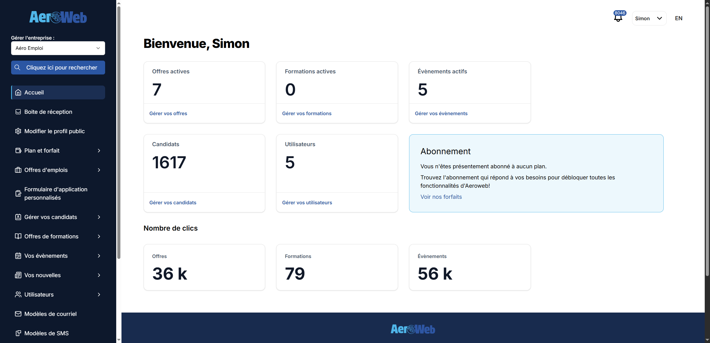

# Aeroweb

[aeroweb.ca](https://aeroweb.ca) est une plateforme qui permet aux utilisateurs de :

-   Créer et gérer des offres d'emplois
-   Créer et gérer des formations
-   Créer et gérer des évènements
-   Gérer les applications et inscriptions
    -   Notes et fichiers sur les profils candidats
    -   Communiquer par SMS, courriel et appel téléphonique
    -   Modifier les statuts

Le site sert de source centralisée pour les affichages de postes (et formations/évènements) qui sont affichés sur tous les autres sites, par exemple :

-   aeroemploi.ca
-   blcpa.ca
-   gebromont.ca
-   aerotalent.ca

Et plus encore. Tous les sites que nous avons créé dans les 3-4 dernières années utilisent Aeroweb comme source pour les postes.

Aeroweb intéragit aussi avec deux systèmes pour générer des affichages de postes :

-   Système de scaping
    -   Scraping par AI (scraper.zeustechnologie.com)
    -   Scraping traditionnel - sélecteurs CSS (scraping.zeustechnologie.com)
-   Système de lecture de flux XML

Ces deux systèmes permettent de récolter automatiquement des affichages de postes sans que les administrateurs des entreprises doivent les créer manuellement dans le dashboard Aeroweb. Les scrapers et les lecteurs de flux XML peuvent être lancés manuellement par un admin, mais il y aussi des tâches cédulées qui font ces actions tous les X jours.

## Pourquoi Aeroweb

Au tout début, nous avions un seul site pour l'affichage des offres d'emplois : aeroemploi.ca. Le site avait son propre dashboard pour créer et gérer les affichages, et les administrateurs des entreprises se connectaient sur ce site directement.

Avec le temps, nous avons développé d'autres sites sur lesquels on souhaitait afficher des postes :

-   JMC Canada
-   GE Bromont
-   BLCPA

Chaque site devait avoir sa propre base de données, et nous devions à chaque fois coder un dashboard pour les admins du site. Ça prenait beaucoup de temps et ajoutait de la complexité.

Nous avons décidé de créer une seule plateforme pour gérer TOUS les affichages de postes, formations et évènements, et d'exposer un API que les autres sites peuvent utiliser pour récupérer les affichages, créer des inscriptions, etc.

Ça nous permet de développer des nouveaux sites très rapidement.
