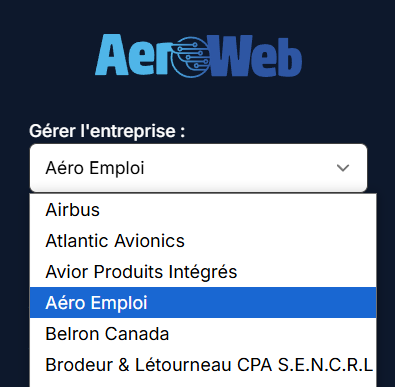
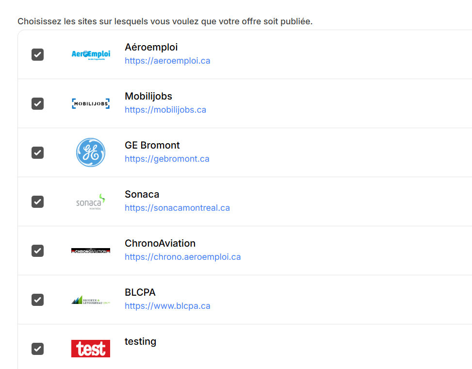

# Détails techniques

## Technologies utilisées

L'application Aeroweb est développée avec les technologies suivantes :

-   Back-end Laravel (v.11)
-   Front-end Vue 3 et TailwindCSS 3, avec [InertiaJS](https://www.inertiajs.com/)
-   Base de données Postgres (v.16)
-   Certains composants [PrimeVue](https://primevue.org/) (mais la plupart sont custom)
-   Mailgun pour l'envoi des courriels transactionnels

## Architecture

Les principaux concepts sont :

-   Utilisateur `User` (nom, email, mot de passe, téléphone)
-   Entreprise `Company` (nom, logo)
    -   Les entreprises sont liés à des utilisateurs via `company_user` (company_id, user_id)
-   Offres d'emplois `Offer` (company_id, user_id, title, description)
-   Formations `Formation` (company_id, user_id, title, description)
-   Évènements `Event` (company_id, user_id, title, description)
-   Candidat `Candidate` (user_id, name, email, téléphone)
-   Applications `Application` (user_id, candidate_id, offer_id, resume, status, date)
-   Inscriptions aux formations `FormationInscription` (user_id, candidate_id, formation_id, resume, status, date)
-   Inscriptions aux évènements `EventInscription` (user_id, candidate_id, event_id, resume, status, date)
-   Sites `Website` (nom, logo, url)
    -   Les sites sont liés aux entreprises via `website_allowed_companies`, et aux offres/formations/évènements via des tables comme `website_offer` et `website_formation` (website_id, offer_id)

## Comptes utilisateurs

Les administrateurs des entreprises se connectent avec un `email ` et un `password`. Chaque admin à son propre compte dans la table `users`.

Un `user` peut être lié à une ou plusieurs entreprises. Un utilisateur connecté peut changer d'entreprise active en utilisant un menu déroulant dans la barre de navigation principale du dashboard Aeroweb :



## Entreprises

Il y a deux façons pour un utilisateur de se joindre à une entreprise :

-   Créer une entreprise (https://aeroweb.ca/creez-votre-entreprise)
-   Être invité à une entreprise par un utilisateur existant

Chaque entreprise auquel l'utilisateur a accès a sa propre URL pour afficher le dashboard. Par exemple :

-   https://aeroweb.ca/1-Aeroemploi
-   https://aeroweb.ca/airbus

On utilise le champ `slug` de la `Company` pour générer l'URL. Il y a un middleware actif pour toutes les routes (`WorksForCompany`) qui valide que l'utilisateur connecté fait bien parti de l'entreprise qu'il est en train de gérer.

## Candidats

La structure des candidatures est un peu particulière et reflète l'ancien système de gestion d'applications, initalement sur Aeroemploi.

Au tout début, les candidats qui désiraient postuler devaient se créer un compte. Dans la table `users` de Aeroweb, on a donc une entrée pour chaque admin d'une entreprise, mais aussi pour chaque candidat qui postule via Aeroemploi - ou autre.

Les premiers candidats vont avoir des mots de passe qui sont remplis, mais pour les candidats plus récents ce n'est plus le cas car il n'est plus possible de se connecter pour postuler. Sur Aeroemploi et les autres sites, les applications se font sans comptes, et les candidats ne peuvent plus se connecter pour consulter leurs récentes applications et autres informations.

Les seuls utilisateurs qui peuvent se connecter sur Aeroweb sont les admins des entreprises. Bien que les mots de passe des comptes candidats soient encore valide, ceux-ci ne sont pas associé à une entreprise (pas d'entrée dans la table `company_user`) donc ils n'ont pas accès à un dashboard.

C'est pour cette raison que les candidats ont un champ `user_id` qui pointe vers un compte utilisateur associé. Même pour les dernières inscriptions, on crée toujours un `User` en plus d'un `Candidate`.

## Applications, inscriptions aux formations et évènements

Pour les mêmes raisons, les applications sont liés à des `users` (via le champ `user_id`) et nom des candidats spécifiquement.

Si on veut récupérer toutes les applications pour un candidat en particulier, on doit passer par le compte utilisateur associé au candidat :

-   `candidate` -> belongsTo -> `user` -> hasMany -> `applications`

Depuis quelques années, on remplit aussi un champ `candidate_id` sur les `applications` et les `formation_inscriptions` / `event_inscriptions`, mais ce n'est pas le cas pour toutes les applications donc on continue de passer par les utilisateurs pour récupérer les infos.

## Relation entre les candidats et entreprises

La structure des `Candidat` est la suivante :

-   user_id
-   company_id
-   name / email / ...

Un candidat est donc associé à une entreprise en particulier.

Si un candidat postule sur un poste d'Airbus et un autre poste de Bombardier, il y aura deux entrées séparées dans la table `candidats`, une pour chaque `company_id` .

C'est par design, on ne veut pas que les informations soient partagées entre les différentes entreprises - si un admin d'Airbus met un commentaire sur un profil d'un candidat, on ne veut pas qu'un admin de Bombardier voit le commentaire.

C'est tout de même une limitation qui nous a poussée à développer une plateforme séparée pour nos recruteurs exclusivement : [Aeromails](./../aeromails/intro.md)

## Sites

Puisque Aeroweb sert de plateforme centralisée pour afficher des postes sur des dizaines de sites différents, on veut pouvoir contrôler sur quel site on affiche le poste.

On utilise le concept de `Website` pour représenter un de ces sites.

Ce ne sont pas toutes les `Company` qui peuvent créer des postes pour tous les sites. Par exemple, pour le site BLCPA, uniquement les administrateurs de l'entreprise BLCPA sur Aeroweb peuvent afficher leurs postes sur ce site. On controle les accès manuellement via le panneau de contrôle /admin, et les informations sont représentées dans une table `website_allowed_companies` avec les champs :

-   company_id
-   website_id

Il existe aussi une table `website_denied_companies` pour représenter le contraire, soit des sites accessibles à tout le monde SAUF certaines entreprises. Cette fonctionnalité n'est toutefois pas utilisée.

Au moment de créer un poste, on charge tous les sites auxquels la compagnie a accès, et on peut cocher les sites sur lesquels on veut afficher le poste en question :



On crée ensuite des entrées dans la table `website_offer` :

-   website_id
-   offer_id

On se sert de cette table pour charger les sites via l'API.

## API

Aeroweb expose un API via l'URL `api.aeroweb.ca/v1/{website}`, où `{website}` représente un `Website` via son champ `name`.

On a ensuite des sous-routes pour les offres, formations, applications, etc.

Par exemple, pour aller chercher tous les postes affichés sur le site Aéroemploi :
[api.aeroweb.ca/v1/aeroemploi/offers](https://api.aeroweb.ca/v1/aeroemploi/offers)

L'API retourne des réponses en JSON :

```
{
    "data": {
    "current_page": 1,
    "data": [{
        "id": 428311,
        "title": "Peintre",
        "slug": "technicien-en-entretien-d-aeronefs-tea-2",
        "city": "Québec",
        "address": "800, 8e rue de L'Aéroport",
        "is_anonymous": false,
        "company": {
        "name": "Premier Aviation",
        "slug": "93-Premier-Aviation",
        "logo": "https://s3.ca-central-1.amazonaws.com/uploads.aeroemploi.ca/companies/R8MyyIolYOICfpana9GihXMOdDAEsKFryb4fY1Kk.png",
        "subdomain": "premier-aviation"
        },
        "date": "2024-05-17",
    }]
}
```

## Forfaits

Pour pouvoir créer un poste, une entreprise doit soit :

-   Être marquée comme `is_unlimited` (controlé manuellement)
-   Avoir un forfait actif, et assez de postes restants
    -   Ex: pour le forfait de base c'est 3 postes actifs en même temps
-   Acheter un affichage individuel
    -   One-time fee de X$, affichage valide pour 45 jours
    -   Après 45 jours, l'affichage se désactive et on doit payer pour un autre 45 jours ou se prendre un forfait pour continuer de l'afficher

## Extras

On peut aussi acheter des extras pour un poste en particulier. C'est disponible uniquement pour les offres d'emplois, pas pour les formations/évènements.

-   Promouvoir le poste
    -   Pour 7 ou 30 jours
    -   Il apparait en haut des résultats de recherche sur Aéroemploi
    -   Bordure verte pour démarquer le poste
-   Colorer le poste
    -   Pour 7 jours
    -   On choisit une couleur et l'offre se démarque avec une bordure de cette couleur
-   Prime Time
    -   Pour 7 jours
    -   L'offre apparait sur la page d'accueil Aéroemploi

Les extras sont valides uniquement sur Aeroemploi, sur les autres sites les postes en promotions n'ont pas de traitement spécifique.

On utilise les champs suivant pour faire le tracking des extras sur les offres :

-   `is_promoted` / `promoted_until`
-   `is_highlighted` / `highlighted_until`
-   `is_prime_time` / `prime_time_until`

Chaque 30 mins, une job cédulée roule pour aller chercher les postes qui ont des extras expirés, et les modifie.

-   `DeactivateExpiredPromotedOffersJob`
-   `DeactivateHighlightedOffersJob`
-   `DeactivatePrimeTimeOffersJob`
