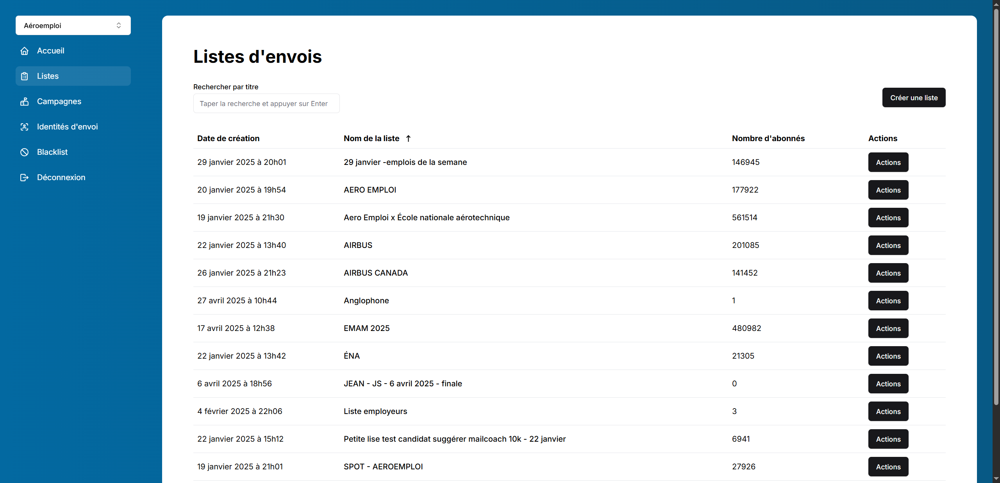
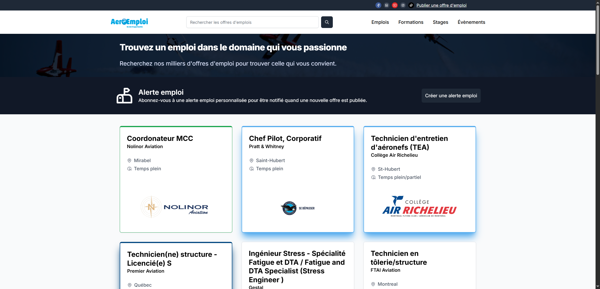
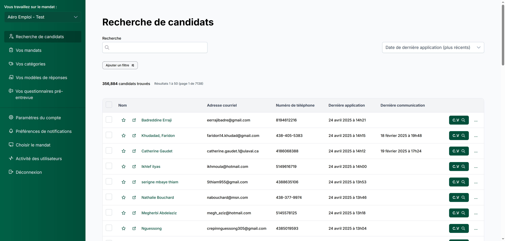
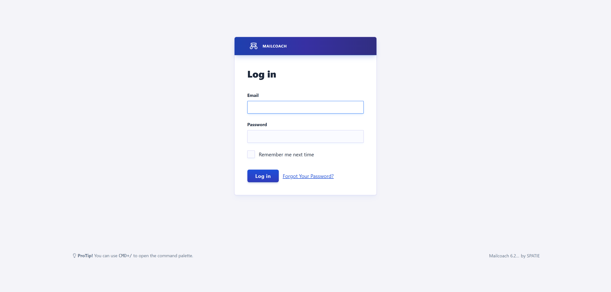
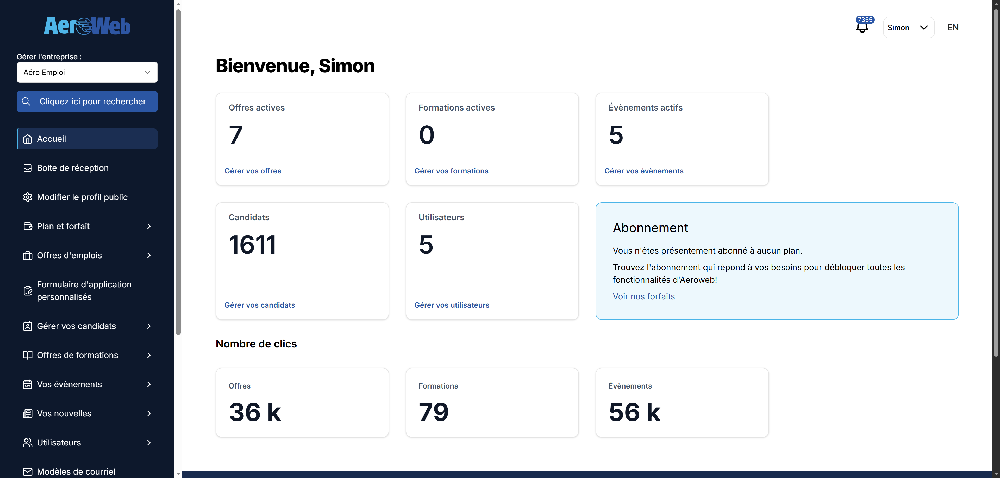
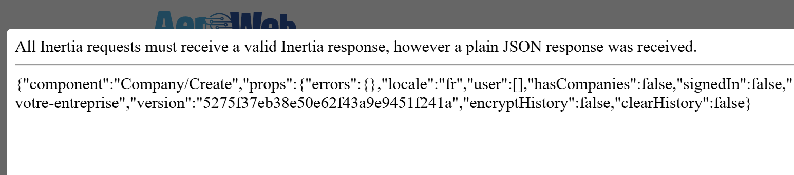
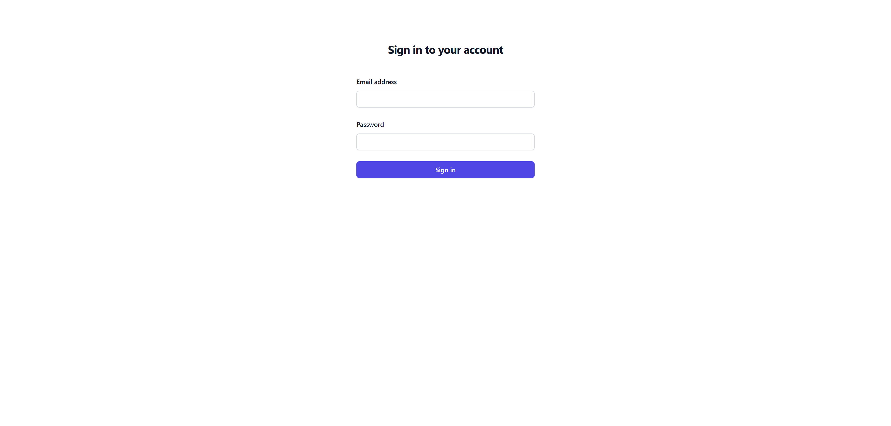
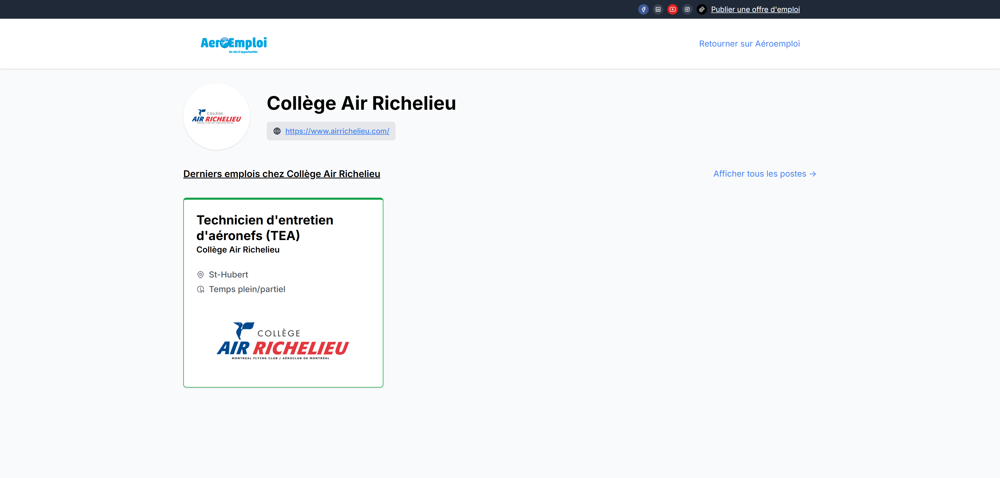

# Détails des sites web

## aeromails.ca



Utilisé à l'interne pour l'envoi de campagnes par courriel. Possibilité de créer des templates, les envoyer à des listes et faire le tracking des opens & clicks. Inclut une page publique pour permettre aux récipients de se désabonner.

| Technologies | Demande | Code |
| ------------ | ------- | ---- |
| Laravel, Vue, TailwindCSS | 🟢Faible à 🔴Élevé | https://gitlab.com/aeroemploi/campaigns |

## click.email.aeromails.ca

Utilisé comme proxy pour les liens qui sont dans les courriels envoyés via aeromails. En ce moment on l'a seulement mit en place pour la page `/employeurs-de-la-semaine`

Comment ça fonctionne : 

- On remplace les liens dans les courriels pour utiliser le proxy. https://aeroemploi.ca devient http://click.email.aeromails.ca?url=https://aeroemploi.ca
- Quand on visite ce lien, on est redirigé vers le site original après quelques instants, en Javsacript (pas de redirection HTTP 301)

Pourquoi : 

Quand on envoit une campagne courriel, on peut envoyer jusqu'à 15 emails / seconde dans le peak. Si un courriel contient une dizaine de liens et que des systèmes automatisés (ex: virus scanner Outlook) visitent ces liens, ça fait des centaines de requêtes par seconde sur nos sites.

Pour éviter ce problème, on redirige sur le proxy à la place, qui est capable de supporter cette charge. Le proxy redirige ensuite les vrais visiteurs sur nos sites, mais les systèmes automatisés vont ignorer ces redirections.

| Technologies | Demande | Code |
| ------------ | ------- | ---- |
| ? | 🟢Faible à 🔴Élevé | ? |

::: tip Note
Demander à Jean de nous fournir les détails sur le code
:::

## aeroemploi.ca



C'est le site sur lequel sont affichés les offres d'emplois, formations et évènements qui sont créés depuis le site aeroweb.ca. C'est un site fait pour rechercher des offres d'emplois et appliquer dessus. C'est le plus gros site public que nous avons.

Le site n'a pas de base de données, et les utilisateurs ne s'y connectent pas. Il interagit avec un API offert par Aeroweb pour aller chercher les offres, les détails d'une offre et pour sauvegarder les applications. C'est Aeroweb qui est responsable de sauvegarder les infos, notifier les admins, envoyer des courriels de confirmation aux candidats, etc.

| Technologies | Demande | Code |
| ------------ | ------- | ---- |
| Laravel, Vue, TailwindCSS | 🟡Moyenne à 🔴Élevé | https://gitlab.com/aeroemploi/aeroemploi-v2 |


## aeroemploi.zeustechnologie.com

Site de staging pour aeroemploi.ca. Au lieu de se connecter à l'API de aeroweb.ca, il se connecte à l'API de aeroweb.zeustechnologie.com (qui est le site de staging de Aeroweb).

C'est le même code que le site aeroemploi.ca, mais nous utilisons soit la branche `develop` ou une branche custom pour tester une nouvelle feature.

| Technologies | Demande | Code |
| ------------ | ------- | ---- |
| Laravel, Vue, TailwindCSS | 🟢Faible | https://gitlab.com/aeroemploi/aeroemploi-v2 |

## aeronouvelle.ca


On y affiche les nouvelles qui sont créées et gérées sur Aeroweb. Avant, nous avions une section "Nouvelles" dédiées sur le site aeroemploi.ca. Puisque cette fonctionnalité est moins utilisé, nous avons migré l'affichage des nouvelles sur un site séparé.

Ce site n'est pas beaucoup utilisé, il y a très peu de lien vers ce site (ex: aeroemploi.ca n'inclut aucun lien vers les nouvelles). Environ une nouvelle est crée chaque 3-4 mois.

| Technologies | Demande | Code |
| ------------ | ------- | ---- |
| Laravel, Vue, TailwindCSS | ⚪Très faible | https://gitlab.com/aeroemploi/aeronouvelles |

## aerotalent.ca



C'est un site destiné à l'usage à l'interne, pour nos recruteurs uniquement. Les candidatures qui proviennent de Aeroweb (et donc de Aeroemploi, ainsi que d'autres sources) y sont stockés et on maintient un seul profil candidat par personne "unique".

**Différence avec Aeroweb**

Sur Aeroweb, nous avons des utilisateurs (`users`) et des entreprises (`companies`). Un utilisateur peut faire parti de plusieurs entreprises. Quand un candidat postule sur un poste d'une entreprise (ex: Airbus), on crée un candidat dans notre base de données (`candidates`) pour cette entreprise spécifiquement : 

```
-- Table candidates
id: 1
company_id: 593
name: Charles
email: charles@example.com
```

Si le même candidat postule ensuite sur un poste d'une autre enterprise (ex: Bombardier), un deuxième profil est créé : 

```
-- Table candidates
id: 2
company_id: 200
name: Charles
email: charles@example.com
```

C'est bien ce que nous voulons, il faut garder les profils séparés pour que les actions des recruteurs d'une entreprise n'affectent pas ou ne soient pas visibles par les recruteurs d'une autre entreprise.

Par contre, pour nos propres recruteurs, ça pose problème. Nos recruteurs ne peuvent pas avoir de vue d'ensemble des candidats, et il arrive qu'un même candidat soit contacté par des recruteurs différents en même temps car ceux-ci ne sont pas en mesure de voir toutes les informations à une seule place.

Sur Aerotalent, la structure est différente. Nous avons toujours une table `candidats` pour sauvegarder les candidatures, mais nous combinons les comptes selon l'adresse courriel.

```
-- Table candidates
id: 1
name: Charles
email: charles@example.com
```

Aerotalent offre les fonctionnalités suivantes pour les recruteurs : 

- Communications avec les candidats via la plateforme (envoi de courriels et SMS, appels téléphoniques)
- Création d'entrevues
- Possibilité de sauvegarder des commentaires et fichiers sur un profil candidat
- Formulaires pré-entrevues

Ces fonctionnalités sont tous présentes sur Aeroweb actuellement, mais puisque c'est presque exclusivement utilisé par nos recruteurs à l'interne, certaines de ces fonctionnalités seront retirées de Aeroweb une fois la migration vers Aerotalent terminée.

| Technologies | Demande | Code |
| ------------ | ------- | ---- |
| Laravel, Vue, TailwindCSS | 🟢Faible pour le moment, ensuite 🟡Moyenne | https://gitlab.com/aeroemploi/aerotalent |

## aerotechnologie.com



Version self-hosted de [Mailcoach](https://www.mailcoach.app/), une application qui permet de créer des campagnes courriels et les envoyer.

Nous avons remplacé cet outil par mail-service.aeroemploi.ca, qui était une version plus récente de Mailcoach mais avec des modifications, et ensuite par aeromails.ca.

::: tip Note
Je pense que nous pouvons supprimé ce site de Forge si ça ne sert plus.
:::

## aerotechnology.ca

C'est l'ancien nom de aeroweb.ca. Nous avons conservé le site dans Forge afin de le conserver pour les redirections, mais je pense que nous pouvons le supprimer. Ça ne fonctionne plus et ça fait plusieurs années que le nom n'a pas servi.

::: tip Note
Je pense que nous pouvons supprimé ce site de Forge si ça ne sert plus.
:::

## aeroweb.ca



C'est la plateforme dont se servent les administrateurs des entreprises pour créer et gérer les postes qui sont ensuite affichés sur aeroemploi.ca.

Historiquement, aeroemploi.ca avait sa propre base de données et un dashboard pour permettre aux recruteurs de créer les postes, consulter les applications, etc. Nous avons décidé de migrer ces fonctionnalités vers aeroweb.ca, et d'exposer un API pour récupérer les postes, sauvegarder les applications, etc.

**Pourquoi utiliser un site différent pour ça?**

La principale raison est que ça nous permet d'utiliser un seul site, un seul dashboard, Aeroweb, pour gérer les postes (et formations/évènements/nouvelles) qui sont affichés sur plusieurs sites. Ce n'est pas juste aeroemploi.ca qui affiche les postes, ceux-ci se retrouvent sur des dizaines de site comme BLCPA, GEBromont, Aeronouvelles, des micros-sites pour Bombardier et Airbus, et plus encore.

Quand on crée un item sur Aeroweb, on choisit sur quel site on veut publier : 


Ça nous évite d'avoir à coder et maintenir 10 dashboards différents pour faire les mêmes actions.

| Technologies | Demande | Code |
| ------------ | ------- | ---- |
| Laravel, Vue, TailwindCSS | 🟡Moyenne à 🔴Élevé | https://gitlab.com/aeroemploi/aerotechnology |

## aeroweb.zeustechnologie.com

Site de staging pour aeroweb.ca.

C'est le même code que le site aeroweb.ca, mais nous utilisons soit la branche `develop` ou une branche custom pour tester une nouvelle feature.

| Technologies | Demande | Code |
| ------------ | ------- | ---- |
| Laravel, Vue, TailwindCSS | 🟢Faible | https://gitlab.com/aeroemploi/aerotechnology |

## blcpa.aeroweb.ca

On sert le même site que aeroweb.ca depuis cette URL, mais ce n'est pas fonctionnel. On a des erreurs quand on tente de se connecter : 



::: tip Note
Je propose qu'on supprime ce site, ça ne sert plus.
:::

## blcpa.ca


Site pour le cabinet comptable Brodeur & Létourneau.

Il y a une section `/joindre-equipe` qui affiche des postes qui sont gérés depuis Aeroweb, et des sections `/nouvelles` et `/evenements` qui affichent les nouvelles et évènements Aeroweb pour l'entreprise BLCPA.

| Technologies | Demande | Code |
| ------------ | ------- | ---- |
| Laravel, Vue, TailwindCSS | 🟢Faible | https://gitlab.com/aeroemploi/blcpa |

## blcpa.zeustechnologie.com

Site de staging pour blcpa.ca. Sert très peu, même concept que les autres sites de staging - on utilise le même code mais une branche différente (`develop`).

| Technologies | Demande | Code |
| ------------ | ------- | ---- |
| Laravel, Vue, TailwindCSS | ⚪Très faible | https://gitlab.com/aeroemploi/blcpa |

## candidates-finder.zeustechnologie.com



Je n'ai pas les accès mais de mémoire c'est un interface qui permet de consulter les CVs qui sont récoltés par le "scraper". Ce site ne sert plus puisque les informations des candidats trouvés sont envoyés automatiquement sur Aeroweb, et sauvegardées dans la table `suggested_candidates` dans la BD Aeroweb.

| Technologies | Demande | Code |
| ------------ | ------- | ---- |
| Node JS (Nest), Vue, TailwindCSS | ⚪Très faible | https://gitlab.com/aeroemploi/candidates-finder |

::: tip Note
Si ça ne sert plus, supprimer le site de Forge. Si ça sert encore et qu'on le garde, me fournir les accès et demander à Jean de documenter le fonctionnement.
:::

## chronogroup.aeroemploi.ca


Servait auparavant à afficher les postes de la compagnie Chrono Aviation. Il y a avait à ce moment là quelques compagnies qui avaient un sous-domaine dédié sur aeroemploi.ca pour afficher leurs postes avec leur logo, leurs couleurs, etc.

La dernière version d'Aeroemploi fournit à tout le monde des sous-domaines : 

https://college-air-richelieu.aeroemploi.ca/


::: tip Note
Supprimer le site de Forge, ça ne fonctionne plus.
:::

## exceldorcoop.ca


Le site ne fonctionne plus. En consultant le code, je vois que c'était un petit site avec trois pages seulement : accueil, emplois, évènements.

::: tip Note
Supprimer le site de Forge, ça ne fonctionne plus / ne sert plus.
:::

| Technologies | Demande | Code |
| ------------ | ------- | ---- |
| Laravel, TailwindCSS | ⚪Très faible | https://gitlab.com/aeroemploi/exceldor |

## gebromont.ca

## inscriptionuqac.ca

## jmc-canada.ca

## jmcgroup.aeroemploi.ca

## jobsatbombardier.com

## joignezbombardier.ca

## mail-service.aeroemploi.ca

## mail-service.placementspot.ca

## placementspot.ca

## placementspot.zeustechnologie.com

## plausible.zeustechnologie.com

## pratt.aeroweb.ca

## propulsetacarriere.ca

## salonfac.ca

## scraper.zeustechnologie.com

## scraping.zeustechnologie.com

## sms-service.aeroemploi.ca

## sonacamontreal.ca

## transat.zeustechnologie.com

## twilio-aerotalent.zeustechnologie.com

## twilio.zeustechnologie.com

## typesense.zeustechnologie.com