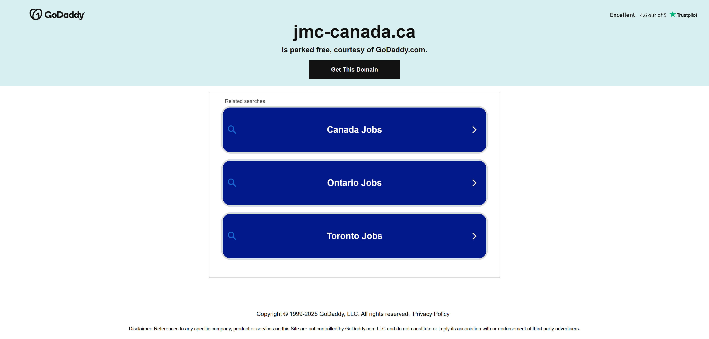
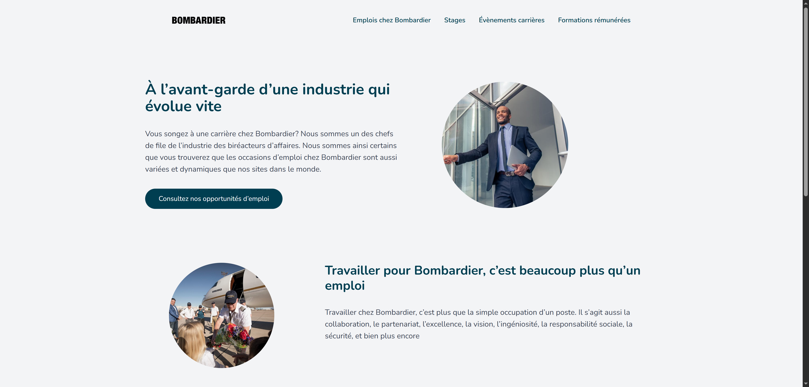
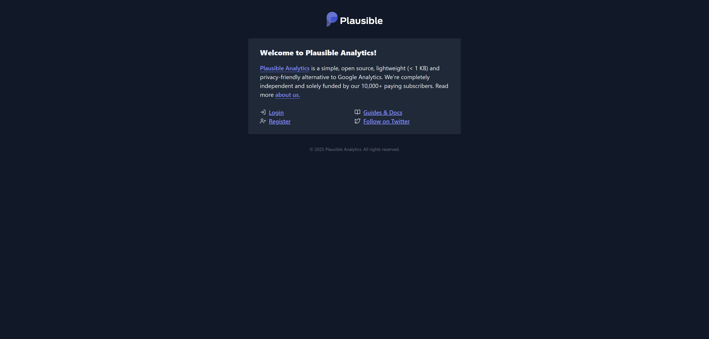
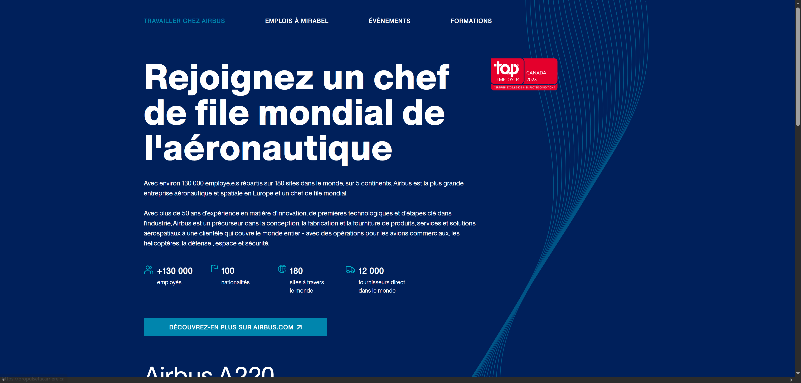
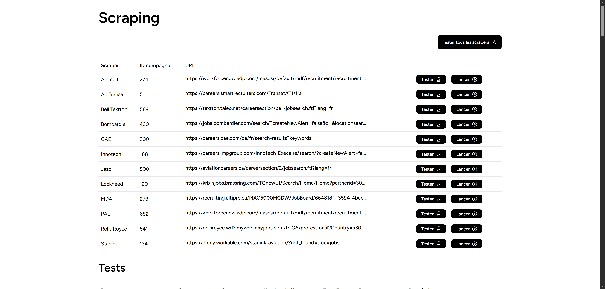
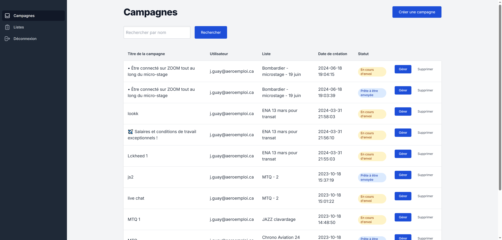
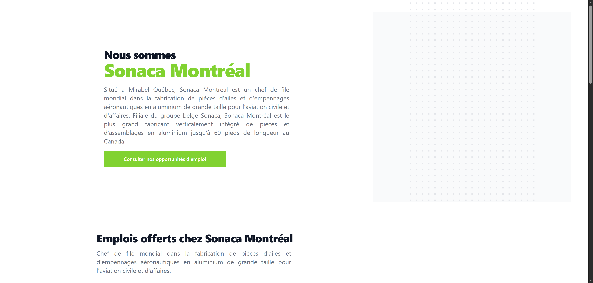
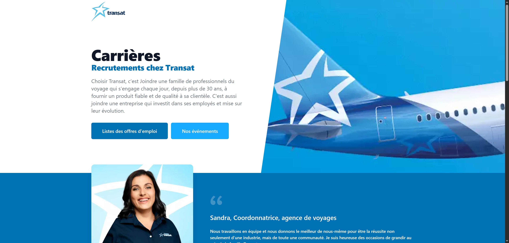

# Détails des sites web

## aeromails.ca


Utilisé à l'interne pour l'envoi de campagnes par courriel. Possibilité de créer des templates, les envoyer à des listes et faire le tracking des opens & clicks. Inclut une page publique pour permettre aux récipients de se désabonner.

| Technologies | Demande | Code |
| ------------ | ------- | ---- |
| Laravel, Vue, TailwindCSS | 🟢Faible à 🔴Élevé | https://gitlab.com/aeroemploi/campaigns |

## click.email.aeromails.ca

Utilisé comme proxy pour les liens qui sont dans les courriels envoyés via aeromails. En ce moment on l'a seulement mit en place pour la page `/employeurs-de-la-semaine`

**Comment ça fonctionne?** 

- On remplace les liens dans les courriels pour utiliser le proxy. https://aeroemploi.ca devient http://click.email.aeromails.ca?url=https://aeroemploi.ca
- Quand on visite ce lien, on est redirigé vers le site original après quelques instants, en Javsacript (pas de redirection HTTP 301)

**Pourquoi utiliser un proxy pour les liens?**

Quand on envoit une campagne courriel, on peut envoyer jusqu'à 15 emails / seconde dans le peak. Si un courriel contient une dizaine de liens et que des systèmes automatisés (ex: virus scanner Outlook) visitent ces liens, ça fait des centaines de requêtes par seconde sur nos sites.

Pour éviter ce problème, on redirige sur le proxy à la place, qui est capable de supporter cette charge. Le proxy redirige ensuite les vrais visiteurs sur nos sites, mais les systèmes automatisés vont ignorer ces redirections.

| Technologies | Demande | Code |
| ------------ | ------- | ---- |
| ? | 🟢Faible à 🔴Élevé | ? |

::: tip Note
Demander à Jean de nous fournir les détails sur le code
:::

## aeroemploi.ca


C'est le site sur lequel sont affichés les offres d'emplois, formations et évènements qui sont créés depuis le site aeroweb.ca. C'est un site fait pour rechercher des offres d'emplois et appliquer dessus. C'est le plus gros site public que nous avons.

Le site n'a pas de base de données, et les utilisateurs ne s'y connectent pas. Il interagit avec un API offert par Aeroweb pour aller chercher les offres, les détails d'une offre et pour sauvegarder les applications. C'est Aeroweb qui est responsable de sauvegarder les infos, notifier les admins, envoyer des courriels de confirmation aux candidats, etc.

| Technologies | Demande | Code |
| ------------ | ------- | ---- |
| Laravel, Vue, TailwindCSS | 🟡Moyenne à 🔴Élevé | https://gitlab.com/aeroemploi/aeroemploi-v2 |


## aeroemploi.zeustechnologie.com

Site de staging pour aeroemploi.ca. Au lieu de se connecter à l'API de aeroweb.ca, il se connecte à l'API de aeroweb.zeustechnologie.com (qui est le site de staging de Aeroweb).

C'est le même code que le site aeroemploi.ca, mais nous utilisons soit la branche `develop` ou une branche custom pour tester une nouvelle feature.

| Technologies | Demande | Code |
| ------------ | ------- | ---- |
| Laravel, Vue, TailwindCSS | 🟢Faible | https://gitlab.com/aeroemploi/aeroemploi-v2 |

## aeronouvelle.ca


On y affiche les nouvelles qui sont créées et gérées sur Aeroweb. Avant, nous avions une section "Nouvelles" dédiées sur le site aeroemploi.ca. Puisque cette fonctionnalité est moins utilisé, nous avons migré l'affichage des nouvelles sur un site séparé.

Ce site n'est pas beaucoup utilisé, il y a très peu de lien vers ce site (ex: aeroemploi.ca n'inclut aucun lien vers les nouvelles). Environ une nouvelle est crée chaque 3-4 mois.

| Technologies | Demande | Code |
| ------------ | ------- | ---- |
| Laravel, Vue, TailwindCSS | ⚪Très faible | https://gitlab.com/aeroemploi/aeronouvelles |

## aerotalent.ca


C'est un site destiné à l'usage à l'interne, pour nos recruteurs uniquement. Les candidatures qui proviennent de Aeroweb (et donc de Aeroemploi, ainsi que d'autres sources) y sont stockés et on maintient un seul profil candidat par personne "unique".

**Différence avec Aeroweb**

Sur Aeroweb, nous avons des utilisateurs (`users`) et des entreprises (`companies`). Un utilisateur peut faire parti de plusieurs entreprises. Quand un candidat postule sur un poste d'une entreprise (ex: Airbus), on crée un candidat dans notre base de données (`candidates`) pour cette entreprise spécifiquement : 

```
-- Table candidates
id: 1
company_id: 593
name: Charles
email: charles@example.com
```

Si le même candidat postule ensuite sur un poste d'une autre enterprise (ex: Bombardier), un deuxième profil est créé : 

```
-- Table candidates
id: 2
company_id: 200
name: Charles
email: charles@example.com
```

C'est bien ce que nous voulons, il faut garder les profils séparés pour que les actions des recruteurs d'une entreprise n'affectent pas ou ne soient pas visibles par les recruteurs d'une autre entreprise.

Par contre, pour nos propres recruteurs, ça pose problème. Nos recruteurs ne peuvent pas avoir de vue d'ensemble des candidats, et il arrive qu'un même candidat soit contacté par des recruteurs différents en même temps car ceux-ci ne sont pas en mesure de voir toutes les informations à une seule place.

Sur Aerotalent, la structure est différente. Nous avons toujours une table `candidats` pour sauvegarder les candidatures, mais nous combinons les comptes selon l'adresse courriel.

```
-- Table candidates
id: 1
name: Charles
email: charles@example.com
```

Aerotalent offre les fonctionnalités suivantes pour les recruteurs : 

- Communications avec les candidats via la plateforme (envoi de courriels et SMS, appels téléphoniques)
- Création d'entrevues
- Possibilité de sauvegarder des commentaires et fichiers sur un profil candidat
- Formulaires pré-entrevues

Ces fonctionnalités sont tous présentes sur Aeroweb actuellement, mais puisque c'est presque exclusivement utilisé par nos recruteurs à l'interne, certaines de ces fonctionnalités seront retirées de Aeroweb une fois la migration vers Aerotalent terminée.

| Technologies | Demande | Code |
| ------------ | ------- | ---- |
| Laravel, Vue, TailwindCSS | 🟢Faible pour le moment, ensuite 🟡Moyenne | https://gitlab.com/aeroemploi/aerotalent |

## aerotechnologie.com


Version self-hosted de [Mailcoach](https://www.mailcoach.app/), une application qui permet de créer des campagnes courriels et les envoyer.

Nous avons remplacé cet outil par mail-service.aeroemploi.ca, qui était une version plus récente de Mailcoach mais avec des modifications, et ensuite par aeromails.ca.

::: tip Note
Je pense que nous pouvons supprimé ce site de Forge si ça ne sert plus.
:::

## aerotechnology.ca

C'est l'ancien nom de aeroweb.ca. Nous avons conservé le site dans Forge pour les redirections, mais je pense que nous pouvons le supprimer. Ça ne fonctionne plus et ça fait plusieurs années que le nom n'a pas servi.

::: tip Note
Je pense que nous pouvons supprimé ce site de Forge si ça ne sert plus.
:::

## aeroweb.ca


C'est la plateforme dont se servent les administrateurs des entreprises pour créer et gérer les postes qui sont ensuite affichés sur aeroemploi.ca.

Historiquement, aeroemploi.ca avait sa propre base de données et un dashboard pour permettre aux recruteurs de créer les postes, consulter les applications, etc. Nous avons décidé de migrer ces fonctionnalités vers aeroweb.ca, et d'exposer un API pour récupérer les postes, sauvegarder les applications, etc.

**Pourquoi utiliser un site différent pour ça?**

La principale raison est que ça nous permet d'utiliser un seul site, un seul dashboard, Aeroweb, pour gérer les postes (et formations/évènements/nouvelles) qui sont affichés sur plusieurs sites. Ce n'est pas juste aeroemploi.ca qui affiche les postes, ceux-ci se retrouvent sur des dizaines de site comme BLCPA, GEBromont, Aeronouvelles, des micros-sites pour Bombardier et Airbus, et plus encore.

Quand on crée un item sur Aeroweb, on choisit sur quel site on veut publier : 


Ça nous évite d'avoir à coder et maintenir 10 dashboards différents pour faire les mêmes actions.

| Technologies | Demande | Code |
| ------------ | ------- | ---- |
| Laravel, Vue, TailwindCSS | 🟡Moyenne à 🔴Élevé | https://gitlab.com/aeroemploi/aerotechnology |

## aeroweb.zeustechnologie.com

Site de staging pour aeroweb.ca.

C'est le même code que le site aeroweb.ca, mais nous utilisons soit la branche `develop` ou une branche custom pour tester une nouvelle feature.

| Technologies | Demande | Code |
| ------------ | ------- | ---- |
| Laravel, Vue, TailwindCSS | 🟢Faible | https://gitlab.com/aeroemploi/aerotechnology |

## blcpa.aeroweb.ca

On sert le même site que aeroweb.ca depuis cette URL, mais ce n'est pas fonctionnel. On a des erreurs quand on tente de se connecter : 


::: tip Note
Je propose qu'on supprime ce site, ça ne sert plus.
:::

## blcpa.ca


Site pour le cabinet comptable Brodeur & Létourneau.

Il y a une section `/joindre-equipe` qui affiche des postes qui sont gérés depuis Aeroweb, et des sections `/nouvelles` et `/evenements` qui affichent les nouvelles et évènements Aeroweb pour l'entreprise BLCPA.

| Technologies | Demande | Code |
| ------------ | ------- | ---- |
| Laravel, Vue, TailwindCSS | 🟢Faible | https://gitlab.com/aeroemploi/blcpa |

## blcpa.zeustechnologie.com

Site de staging pour blcpa.ca. Sert très peu, même concept que les autres sites de staging - on utilise le même code mais une branche différente (`develop`).

| Technologies | Demande | Code |
| ------------ | ------- | ---- |
| Laravel, Vue, TailwindCSS | ⚪Très faible | https://gitlab.com/aeroemploi/blcpa |

## candidates-finder.zeustechnologie.com


Je n'ai pas les accès mais de mémoire c'est un interface qui permet de consulter les CVs qui sont récoltés par le "scraper". Ce site ne sert plus puisque les informations des candidats trouvés sont envoyés automatiquement sur Aeroweb, et sauvegardées dans la table `suggested_candidates` dans la BD Aeroweb.

| Technologies | Demande | Code |
| ------------ | ------- | ---- |
| Node JS (Nest), Vue, TailwindCSS | ⚪Très faible | https://gitlab.com/aeroemploi/candidates-finder |

::: tip Note
Si ça ne sert plus, supprimer le site de Forge. Si ça sert encore et qu'on le garde, me fournir les accès et demander à Jean de documenter le fonctionnement.
:::

## chronogroup.aeroemploi.ca


Servait auparavant à afficher les postes de la compagnie Chrono Aviation. Il y a avait à ce moment là quelques compagnies qui avaient un sous-domaine dédié sur aeroemploi.ca pour afficher leurs postes avec leur logo, leurs couleurs, etc.

La dernière version d'Aeroemploi fournit à tout le monde des sous-domaines : 

https://college-air-richelieu.aeroemploi.ca/


::: tip Note
Supprimer le site de Forge, ça ne fonctionne plus.
:::

## exceldorcoop.ca


Le site ne fonctionne plus. En consultant le code, je vois que c'était un petit site avec trois pages seulement : accueil, emplois, évènements.

::: tip Note
Supprimer le site de Forge, ça ne fonctionne plus / ne sert plus.
:::

| Technologies | Demande | Code |
| ------------ | ------- | ---- |
| Laravel, TailwindCSS | ⚪Très faible | https://gitlab.com/aeroemploi/exceldor |

## gebromont.ca


Site qui présente l'entreprise GE Bromont, inclut des pages plus détaillées pour certains postes (ex: outilleurs, maintenance) et une page générique `/emploi` avec une liste de postes. Les données proviennent de l'API Aeroweb.

| Technologies | Demande | Code |
| ------------ | ------- | ---- |
| Laravel, Vue, TailwindCSS | 🟢Faible | https://gitlab.com/aeroemploi/gebromont |

## inscriptionuqac.ca


Site dédié à un programme spécifique pour l'UQAC. La page "Séance d'information" ne fonctionne pas, le bouton "Demande d'admission" redirige vers le site uqac.ca. Le repo Git est archivé pour ce site.

| Technologies | Demande | Code |
| ------------ | ------- | ---- |
| Laravel, Vue, TailwindCSS | ⚪Très faible | https://gitlab.com/aeroemploi/uqac-programme-court |

::: tip Note
Ce site peut probablement être supprimé, ne fonctionne plus.
:::

## jmc-canada.ca



Nous n'avons plus ce nom de domaine, à supprimer.

::: tip Note
Ce site peut probablement être supprimé, ne fonctionne plus.
:::

## jmcgroup.aeroemploi.ca


Même chose que chronogroup.aeroemploi.ca, ça ne sert plus 

::: tip Note
Supprimer le site de Forge, ça ne fonctionne plus.
:::

## jobsatbombardier.com


Petit site pour présenter des postes de Bombardier, n'a pas été utilisé depuis longtemps et le chargement des offres d'emplois (qui proviennent de l'API Aeroweb) ne fonctionne plus.

::: tip Note
Supprimer le site de Forge, ça ne fonctionne plus.
:::

| Technologies | Demande | Code |
| ------------ | ------- | ---- |
| Laravel, Vue, TailwindCSS | ⚪Très faible | https://gitlab.com/aeroemploi/bombardier-us |


## joignezbombardier.ca



Version plus complète du site "jobsatbombardier", version FR cette fois-ci. Même look que le site US mais contient des sections supplémentaires pour les stages, évènements et formations. Ce site est fonctionnel et on peut postuler.

| Technologies | Demande | Code |
| ------------ | ------- | ---- |
| Laravel, Vue, TailwindCSS | ⚪Très faible | https://gitlab.com/aeroemploi/bombardier |

## mail-service.aeroemploi.ca


Application qui intéragit avec l'API de Mailcoach. C'est une version différente et plus récente de la version self-hosted de Mailcoach qui se trouve sur aerotechnologie.com. C'était l'outil pour faire l'envoi des campagnes courriels avant qu'on crée aeromails.ca

Ne sert plus pour nous maintenant. On peut le garder comme backup mais je ne pense pas que ça sert vu que ça n'a pas été mis à jour depuis pas mal de temps. Vaut mieux faire les updates sur aeromails plutôt que de maintenir deux outils qui font la même chose.

Le même code est utilisé pour la version pour le SPOT, qui elle sert encore.

| Technologies | Demande | Code |
| ------------ | ------- | ---- |
| Laravel, Vue, TailwindCSS | ⚪Très faible | https://gitlab.com/aeroemploi/mailer |

## mail-service.placementspot.ca


Même chose que mail-service.aeroemploi.ca, mais cet outil est encore utilisé par les admins du SPOT pour faire leurs envois de campagnes courriels.

| Technologies | Demande | Code |
| ------------ | ------- | ---- |
| Laravel, Vue, TailwindCSS | 🟢Faible | https://gitlab.com/aeroemploi/mailer |

## placementspot.ca


Très gros site pour l'affichage de stages, mini-stages et micro-stages par le CMAI. Avec Aeroweb et Aeroemploi c'est notre site le plus gros et le plus utilisé.

Il y a plusieurs pages publiques pour que les étudiants consultent les stages offerts et y appliquent. Les étudiants doivent se créer un compte pour postuler et peuvent consulter/modifier leur profil.

Les administrateurs des entreprises se connectent aussi à la plateforme pour créer les stages, consulter les applications, etc. Contrairement à Aeroemploi et Aeroweb qui sont deux sites séparés, tout se passe sur le même site pour le SPOT.

Les administrateurs du SPOT peuvent aussi se connecter pour générer des rapports et faire certaines actions.

| Technologies | Demande | Code |
| ------------ | ------- | ---- |
| Laravel, Vue, TailwindCSS | 🟡Moyenne à 🔴Élevé | https://gitlab.com/aeroemploi/placement-spot |

## placementspot.zeustechnologie.com

Site de staging pour placementspot.ca. Connecté au même repo sur Gitlab mais nous utilisons la branche `develop` à la place de `master`.

| Technologies | Demande | Code |
| ------------ | ------- | ---- |
| Laravel, Vue, TailwindCSS | 🟢Faible | https://gitlab.com/aeroemploi/placement-spot |

## plausible.zeustechnologie.com



Application self-hosted ( [Plausible](https://plausible.io/) ) pour les analytics, utilisé en remplacement à Google Analytics pour obtenir des informations sur les visites Aeroemploi principalement.

Sur Aeroweb, un script roule plusieurs fois par jour pour aller chercher les stats sur plausible.zeustechnologie.com et les mettre à jour dans la BD Aeroweb. Ces informations sont sauvegardées dans les champs `stats_breakdown`, `stats_timeseries` et `stats_last_sync` dans la table `offers`. 

Le service ne fonctionne pas bien depuis longtemps et les stats sont souvent manquantes. À remplacer éventuellement par quelque chose de plus complet/robuste.

| Technologies | Demande | Code |
| ------------ | ------- | ---- |
| ? | 🟢Faible | ? |

## pratt.aeroweb.ca

Même chose que blcpa.aeroweb.ca, à supprimer car ça ne fonctionne pas.

::: tip Note
Supprimer le site car il ne sert plus et ne fonctionne pas.
:::

## propulsetacarriere.ca



Site pour faire la présentation des emplois et formations chez Airbus Canada.

C'est un autre site qui appelle l'API de Aeroweb pour aller chercher les informations. On peut consulter les détails et postuler directement sur ce site.

| Technologies | Demande | Code |
| ------------ | ------- | ---- |
| Laravel, Vue, TailwindCSS | 🟢Faible | https://gitlab.com/aeroemploi/airbus |

## salonfac.ca

Site non-fonctionnel pour le moment, depuis les derniers problèmes avec le serveur WHC je crois. Problème de SSL et de connexion à la base de données.

::: tip Note
Vérifier si le site est encore utile et si ça vaut la peine de le réparer, ou on peut le supprimer si ça ne sert plus.
:::

## scraper.zeustechnologie.com

Micro-service en Node JS développé par Jean pour faire le scraping des offres d'emplois.

L'application expose des routes d'API pour lancer le scraping, et utiliser ensuite un système de webhooks pour communiquer avec Aeroweb et lui fournir les offres trouvées. Le micro-service utilise l'intelligence artificielle (Open AI) pour extraire les sélecteurs CSS et le contenu des pages.

Pour intéragir avec ce service, les admins (JS) passent par la section `/admin` du site Aeroweb.

Le site est dans Forge mais ne peut pas être controlé via Forge, il faut lancer des commandes manuellement pour avoir accès aux logs, redémarrer le service, etc. La procédure pour les déploiements n'est pas claire non plus.

C'est un seul gros fichier Javascript et il n'y a pas de dashboard pour gérer les scrapers.

| Technologies | Demande | Code |
| ------------ | ------- | ---- |
| Node JS | 🟡Moyenne | https://gitlab.com/aeroemploi/scrapper |

## scraping.zeustechnologie.com



Ancienne version du scraper (scraper.zeustechnologie.com) qui servait avant. C'est une application Laravel qui fait des requêtes HTTP à des URLs spécifiés pour y extraire les postes, en recherchant les selecteurs CSS dans la page.

Cette application a été remplacée par un système qui utilise l'IA pour que ça soit plus fiable.

Le fonctionnement est différent au scraper.zeustechnologie.com. Pour lancer un scraper, on passe directement par le dashboard sur le site scraping.zeustechnologie.com et ensuite des webhooks sont utilisés pour fournir les infos sur les nouveaux postes à Aeroweb.

Comme pour le scraper.zeus, c'est Aeroweb qui est responsable de valider les infos et de sauvegarder les postes dans la BD.

| Technologies | Demande | Code |
| ------------ | ------- | ---- |
| Laravel, Vue, TailwindCSS | 🟢Faible | https://gitlab.com/aeroemploi/scraper |

## sms-service.aeroemploi.ca



Application similaire à aeromails/mail-service.aeroemploi, mais pour envoyer des campagnes textos à la place. La dernière campagne a été créée en juin 2024 donc je ne pense pas que ça sert encore beaucoup. On a ajouté la possibilité (mais pas testé) d'envoyer des campagnes textos en utilisant aeromails.ca, puisque les concepts sont similaires (listes, désabonnements, campagnes, templates, etc).

Les numéros qui sont utilisées pour les envois sont gérées via Twilio.

::: tip Note
Si ça ne sert plus, supprimer et focuser sur un service à la place (aeromails)
:::

| Technologies | Demande | Code |
| ------------ | ------- | ---- |
| Laravel, Vue, TailwindCSS | 🟢Faible | https://gitlab.com/aeroemploi/sms |

## sonacamontreal.ca



Petit site simple pour présenter la compagnie Sonaca Montreal et afficher des postes qui sont gérés depuis Aeroweb.

| Technologies | Demande | Code |
| ------------ | ------- | ---- |
| Laravel, Vue, TailwindCSS | 🟢Faible | https://gitlab.com/aeroemploi/sonaca |

## transat.zeustechnologie.com



Petit site simple pour présenter la compagnie Air Transat et afficher des postes et évènements qui sont gérés depuis Aeroweb.

| Technologies | Demande | Code |
| ------------ | ------- | ---- |
| Laravel, Vue, TailwindCSS | 🟢Faible | https://gitlab.com/aeroemploi/air-transat |

## twilio.zeustechnologie.com

Micro-service en Python qui fait le lien entre Twilio et Aeroweb pour les appels entrants.

**Fonctionnement**

Sur Aeroweb et Aerotalent, on peut envoyer des SMS aux candidats et faire des appels téléphoniques. Pour les SMS, on crée un numéro dans Twilio et on peut l'ajouter dans le dashboard admin Aeroweb pour l'associer à une entreprise. On configure le champ "incoming message webhook" pour faire un POST à une URL sur Aeroweb quand un message entre. C'est ensuite Aeroweb qui est responsable de trouver l'entreprise et le candidat associé (en se basant sur le numéro entrant et le numéro sortant) et de créer le message dans notre BD.

Pour les appels, c'est plus compliqué : 

- On veut pouvoir avoir plus d'un numéro par entreprise, comme ça plusieurs recruteurs peuvent faire des appels en même temps (note: à ma connaissance on n'a jamais testé en pratique)
- Quand les candidats appelles un numéro d'une entreprise, il faut sauvegarder les informations et les transmettre à Aeroweb comme on fait pour les textos
- Quand on fait des appels sortants depuis la plateforme, il faut générer un token qu'on utilise ensuite avec le SDK Javascript de Twilio pour faire l'appel

Pour cette raison, on a un micro-service Python fait par Jean qui s'occupe de faire le "bridge" entre les deux systèmes.

Aeroweb appelle ce micro-service pour créer un numéro pour une entreprise. Le micro-service achète un numéro (aléatoire) sur Twilio et le configure (webhooks pour les messages et appels entrants qui fait un POST à Aeroweb). Quand on fait des appels via la plateforme, on contacte d'abord ce micro-service pour obtenir un token qu'on peut utiliser avec Twilio. Quand un candidat appelle le numéro d'une entreprise, ça appelle le micro-service qui sauvegarde la conversation dans S3 et qui fait le POST vers Aeroweb.

| Technologies | Demande | Code |
| ------------ | ------- | ---- |
| Python (single file) | 🟢Faible | https://gitlab.com/aeroemploi/twilio |

## twilio-aerotalent.zeustechnologie.com

Version Aerotalent du service plus haut. Ça utilise le même code mais c'est une URL différente. C'est configuré de cette manière car il faut utiliser des numéros séparés pour Aerotalent. Quand on a un appel entrant à un numéro associé à Aerotalent, alors le micro-service fait un POST vers aerotalent.ca à la place de aeroweb.ca pour le notifier du nouvel appel.

| Technologies | Demande | Code |
| ------------ | ------- | ---- |
| Python (single file) | 🟢Faible | https://gitlab.com/aeroemploi/twilio |

## typesense.zeustechnologie.com

Installation self-hosted du moteur de recherche [Typesense](https://typesense.org/).

C'est installé en utilisant le container Docker fournit par Typesense je crois. En ce moment nous avons un seul serveur Typesense pour tous nos sites (Aerotalent et Aeroweb s'en servent) mais éventuellement on va vouloir les séparer.

Je ne pense pas que ça a besoin d'être un site séparé dans Forge, à revoir.

**Pourquoi Typesense?**

C'est un moteur de recherche ultra-rapide et performant. On s'en sert pour rechercher parmis 300K+ candidats sur Aerotalent, et des dizaines de milliers de postes Aeroweb. C'est beaucoup plus rapide que de se faire appel à nos propres BD Postgres et ça supporte les recherches par mot-clé, les synonymes, le facetting, le highlighting des résultats, les fautes de frappe, etc.