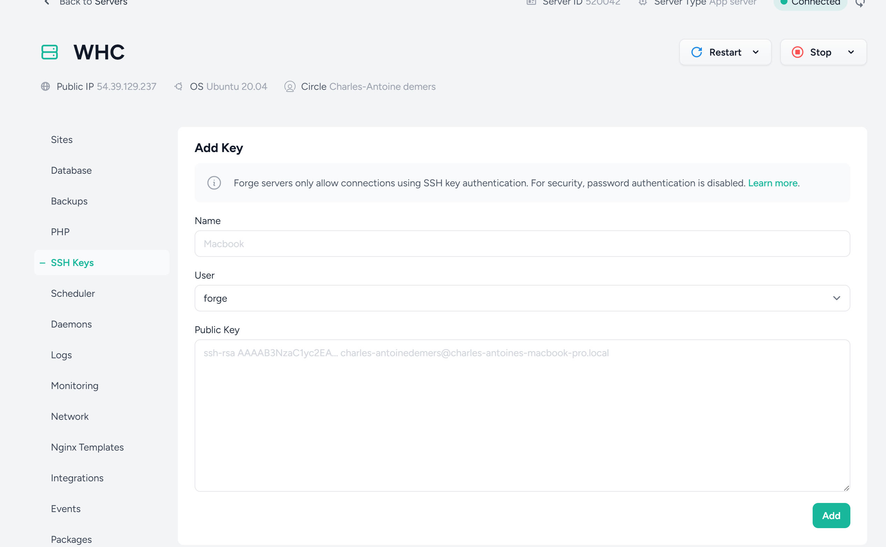
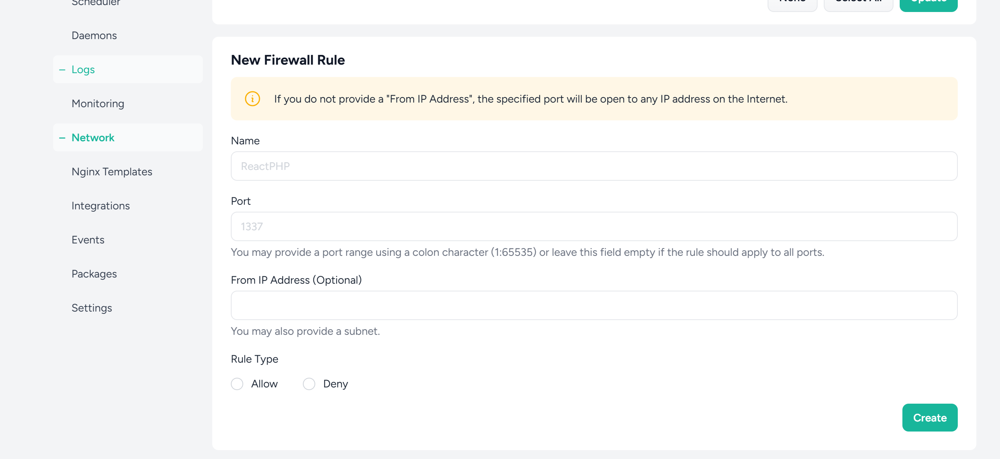
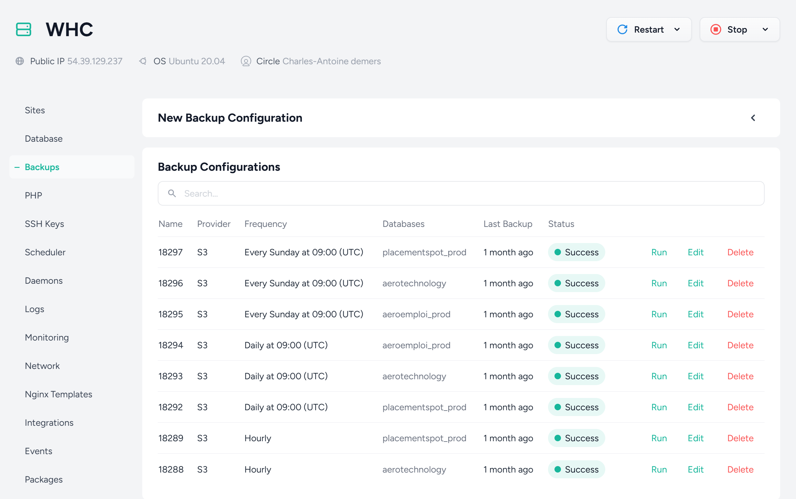

# Sécurité

## Accès aux serveurs

**WHC**

La seule façon de se connecter au serveur WHC est en SSH, la connexion avec mot de passe est désactivé. Il faut générer une clé SSH localement et l'ajouter dans la liste de clés du serveurs. On peut faire ça en passant par Laravel Forge.



On peut ensuite se connecter en SSH : 

```
ssh forge@54.39.129.237
```

**AWS_01**

La procédure pour se connecter à ce serveur n'est pas documentée.

**Bases de données**

Les bases de données sont accessibles en local avec un username/password seulement. La connexion en SSH n'est pas configurée/on ne limite pas à SSH seulement comme pour le serveur.

On peut donc se connecter localement aux bases de données en utilisant les mêmes identifiants qui sont dans les fichiers `.env` pour les sites respectifs.

**Firewall**

Il y a toutefois un firewall en place pour limiter les adresses IPs qui peuvent accéder au serveur. Par defaut l'accès et désactiver, et on doit manuellement ajouter une exception via Laravel Forge, dans la section Network :



L'accès est permis à tous les ports pour les adresses IPs de Jean et de Charles.

## Mises à jour et bugfix

Lorsqu'il y a des mises à jour à apporter sur nos sites, on passe toujours par Laravel Forge. On veut absolument éviter de se connecter manuellement sur le serveur pour y faire des modifications : 

- Il faut impérativement que les modifications passent par Git, sinon on risque de perdre des données
- Chaque site a son propre script de déploiement qui doit être executé pour s'assurer que les mises à jour se fond correctement (update base de données, compilation des assets du front-end, restart des queues workers, etc)

Pour certains sites, le déploiement dans Forge démarre automatiquement quand on `git push` dans la branche correspondante pour le site et l'environnement.

L'accès à Gitlab est limité à Charles, Jean et JS, ainsi qu'à des contracteurs à l'occasion.

## Sauvegardes et restauration

Des sauvegardes automatiques sont supposées être configuré via Forge pour les bases de données : 



Comme on peut voir, la date de dernier backup remonte à plus d'un mois (20 mars 2025).

Il y a aussi plusieurs backups pour une même BD avec des fréquences différentes. Il faudrait comprendre pourquoi c'est configuré de cette façon, et s'assurer que nous avons une stratégie adaptée pour chaque site.

On peut via le dashboard consulter les derniers backups et les télécharger. Il y a aussi une option "Restore", qui permet - j'imagine - de restorer automatiquement les données.

::: danger Note importante
Puisque nous n'avons jamais testé le processus de restauration d'un backup, nous n'avons pas la certitude que celui-ci fonctionne.

Il n'y a pas non plus de procédure à suivre lorsqu'une restauration est nécessaire, et il est probable qu'une intervention manuelle soit nécessaire.

C'est une priorité à mon avis de revoir ce processus et de le tester correctement, et de bien documenter la procédure pour que tout le monde soit en mesure de restaurer une base de données en cas de panne ou d'erreur sévère.
:::

## Certificats SSL

Les certificats SSL peuvent être créés via Forge et sont renouvellés automatiquement.

Toutefois, il arrive que ce processus échoue et nous nous retrouvons avec des certificats invalides, ce qui rend les sites inaccessibles. Nous sommes présentement entrain de corriger un problème avec ce processus, et nous pourrons mieux le documenter par la suite.

## Logs et audits

Chaque site a son propre logs pour les erreurs, mais nous ne maintenons pas de logs pour les accès aux serveurs, aux bases de données, aux sites et à tout autre système - autre que ce qui est configuré automatiquement par certains outils.

Nous n'avons pas de procédures en place pour faire l'audit des accès.

Nous n'avons pas non plus fait d'audit de sécurité du code pour nos plus gros sites, à l'exception d'un rapport de KPMG sur le site placementspot.ca il y a quelques années.